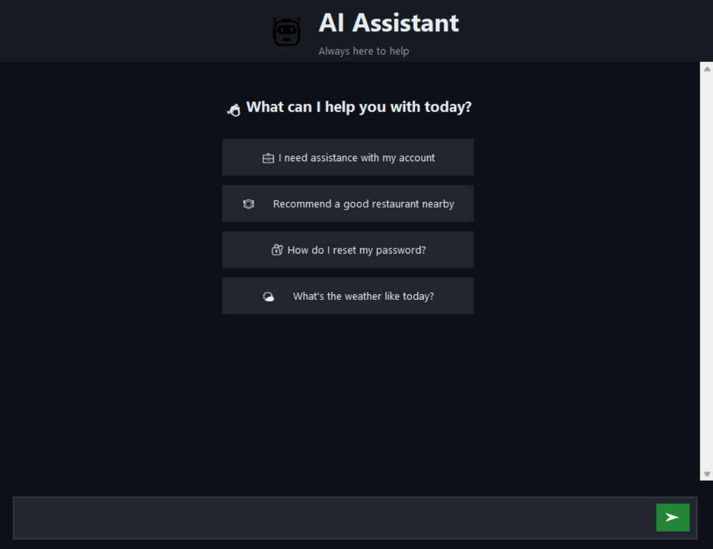

# NLP_Chatbot: A Lightweight Sentiment-Aware AI Chatbot with GUI

## AI Text Generation Chatbot

This project implements a conversational chatbot using AI-based text generation.
The chatbot uses a GPT-style language model to generate human-like responses.

## Features
- AI text generation using TinyLlama-1.1B-Chat
- Context-aware responses with limited conversation memory
- Sentiment-aware replies using TextBlob
- Regex-based output cleaning
- Modern dark-theme GUI (Tkinter)
- Asynchronous response generation (threading)
- Suggestion chips for quick user prompts
- Exit keyword detection

## Technologies Used
- Python 3
- Hugging Face Transformers
- TinyLlama / GPT-style Transformer model
- Tkinter (GUI)
- TextBlob (Sentiment Analysis)
- Regex (re) for text cleaning
- Threading for non-blocking UI

## Project Structure
```
NLP_Chatbot/
│
├── chatbot/
│   ├── ai_generator.py      # AI response generation
│   ├── sentiment.py         # Sentiment analysis
│   ├── utils.py             # Exit & keyword detection
│
├── run_chatbot.py           # Main GUI application
├── requirements.txt
├── README.md
```

## How to Run
- Make sure you have setup conda environments.
- Open anaconda prompt and open the project folder using 

```
cd NLP_chatboot

```
- and then use the following commands
```
conda activate nlp
pip install -r requirements.txt
python run_chatbot.py
```


## NLP Techniques Used
- Regex
- Keyword detection
- Sentiment analysis

## Disclaimer
This project is intended for educational and experimental purposes only. Generated responses may be inaccurate or misleading.

## Screenshots
